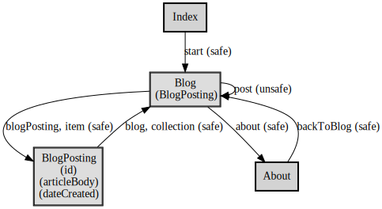

# app-state-diagram

Generates an application state diagram image and vocabulary file from [ALPS](http://alps.io/) document.

## Usage

```
composer require koriym/app-state-diagram

./vendor/bin/asd demo/profile.example.json 
dot -Tsvg demo/profile.example.dot -o demo/profile.example.svg 
```

## Output

* Application State Diagram



* Vocabulary as semantic descriptors

 [profile.md](docs/profile.example.md)

## Requirement

 * php 7.2+
 * [composer](https://getcomposer.org/)
 * graphviz
 
Converting `.dot` into `.png` file requires a working `graphviz` installation.

On Debian or Ubuntu, one may do:

```
sudo apt install graphviz
```

On OSX, one may do after installing Homebrew:

```
sudo brew install graphviz
```

