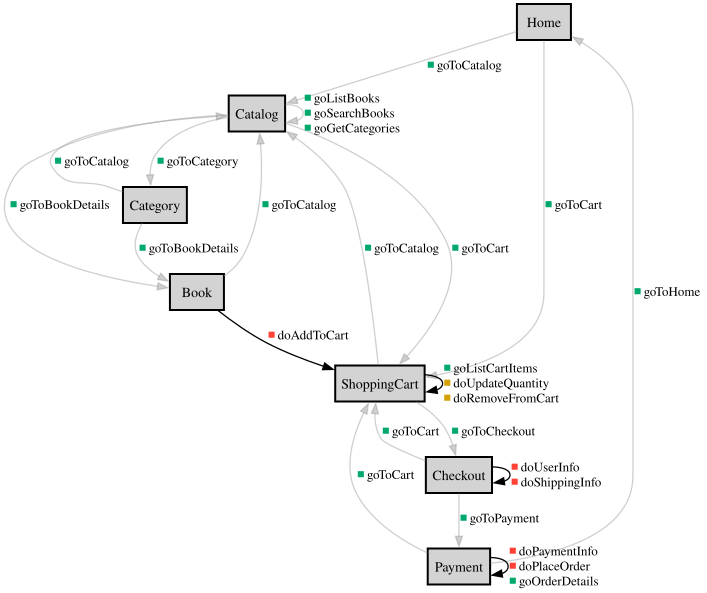

# app-state-diagram

[](https://github.com/alps-asd/app-state-diagram/actions/workflows/ci.yml)
[](https://codecov.io/gh/alps-asd/app-state-diagram)


**app-state-diagram** is a tool that visualizes state transitions and information structures of RESTful applications. It generates interactive state diagrams and hyperlinked documentation from ALPS (Application-Level Profile Semantics) profiles written in XML or JSON.

[](https://editor.app-state-diagram.com/)

## Key Benefits

- **Application Overview**: Visually grasp complex RESTful applications and understand the big picture
- **Clear Information Semantics**: See how data flows and what each element means
- **Enhanced Team Communication**: Both technical and business teams can discuss using the same visual representation
- **Design Consistency**: Represent application structures uniformly and discover design issues early

## Quick Start

### Online Editor (No Installation)

[https://editor.app-state-diagram.com/](https://editor.app-state-diagram.com/)

### Install with Homebrew (Recommended)

```bash
brew install alps-asd/asd/asd
```

Auto-updates with `brew upgrade`.

### Install with npm

```bash
npm install -g @alps-asd/app-state-diagram
```

### Try It

```bash
curl -O https://raw.githubusercontent.com/alps-asd/app-state-diagram/master/docs/bookstore/alps.xml
asd alps.xml
open index.html  # on macOS
```

## CLI Options

```bash
asd [options] <profile.json|profile.xml>
```

| Option | Description |
|--------|-------------|
| `-o, --output <file>` | Output file path |
| `-f, --format <format>` | Output format: `html` (default), `svg`, `dot`, `mermaid` |
| `-w, --watch` | Watch mode with live reload |
| `--port <port>` | CDP port for watch mode (default: 9222) |
| `--label <mode>` | Label mode: `id` (default) or `title` |
| `--validate` | Validate ALPS profile only |
| `-e, --echo` | Output to stdout |

### Subcommands

```bash
asd merge <base.json> <partial.json>  # Merge partial ALPS into base profile
```

## Watch Mode

Start watch mode with automatic Chrome launch and live reload:

```bash
asd -w profile.json
```

Chrome opens automatically with remote debugging enabled. Changes to the ALPS file trigger instant browser refresh.

## Validation

The validator checks for errors, warnings, and suggestions:

- **Errors (E001-E011)** - Missing id/href, missing rt, invalid type, broken references, duplicate ids, etc.
- **Warnings (W001-W004)** - Missing title, naming conventions (go*/do* prefixes), orphan descriptors
- **Suggestions (S001-S003)** - Consider adding doc/title to improve documentation

See [Validation Issues Reference](docs/issues.md) for detailed explanations and how to fix each issue.

```bash
asd profile.json --validate
```

## Examples

See [live demos](docs/demo/) or visit [app-state-diagram.com](https://www.app-state-diagram.com/app-state-diagram/)

## Mock Generation

Generate a browsable HTML mock site from an ALPS profile. Every CSS class in the HTML is an ALPS descriptor ID — zero presentation classes. Switch between bare HTML, wireframe, and production quality by changing one CSS file.

```
alps.xml → html/ + css/level{1,2,3}.css + api/ + i18n/
```

See [AI Integration Guide](https://www.app-state-diagram.com/app-state-diagram/ai-integration.html) for setup (requires `alps2mock` skill).

## Design Application with AI

See [AI Integration Guide](https://www.app-state-diagram.com/app-state-diagram/ai-integration.html) for setting up Claude Code, MCP Server, or other AI tools.

## Documentation

- [Quick Start Guide](https://www.app-state-diagram.com/manuals/1.0/en/quick-start.html)
- [Official Documentation](https://www.app-state-diagram.com/manuals/1.0/en/index.html)

## Related Projects

- [ALPS Specification](http://alps.io/)
- [asd-action](https://github.com/alps-asd/asd-action) - GitHub Action for CI/CD
- [alps-skills](https://github.com/alps-asd/alps-skills) - ALPS skills for Claude Code
- [alps-skeleton-xml](https://github.com/alps-asd/alps-skeleton-xml) - ALPS skeleton (XML)
- [alps-skeleton-json](https://github.com/alps-asd/alps-skeleton-json) - ALPS skeleton (JSON)

## License

MIT
