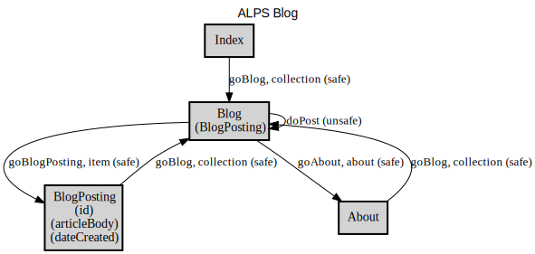

# ALPS Blog

An ALPS profile example for ASD

<!-- Container for the ASDs -->

## Semantic Descriptors

| Type | ID | Title | Contained | Extra Info |
| :--: | :-- | :---- | :-- | :-- |
| semantic | [About](#About) | About Us | <a href="#goBlog">goBlog</a> |  |
| semantic | [articleBody](#articleBody) | article body |  | def:<a href="https://schema.org/articleBody" target="_blank">schema.org/articleBody</a> |
| semantic | [Blog](#Blog) | Blog Post List | <a href="#BlogPosting">BlogPosting</a> <a href="#goAbout">goAbout</a> <a href="#goBlogPosting">goBlogPosting</a> <a href="#doPost">doPost</a> | def:<a href="https://schema.org/Blog" target="_blank">schema.org/Blog</a> tag:<a href="#tag-collection">collection</a> |
| semantic | [BlogPosting](#BlogPosting) | Blog Post | <a href="#id">id</a> <a href="#dateCreated">dateCreated</a> <a href="#articleBody">articleBody</a> <a href="#goBlog">goBlog</a> | def:<a href="https://schema.org/BlogPosting" target="_blank">schema.org/BlogPosting</a> tag:<a href="#tag-item">item</a> |
| semantic | [dateCreated](#dateCreated) | create date |  | def:<a href="https://schema.org/dateCreated" target="_blank">schema.org/dateCreated</a> |
| unsafe | [doPost](#doPost) | Post the article | <a href="#articleBody">articleBody</a> | def:<a href="https://activitystrea.ms/specs/json/1.0/#post-verb" target="_blank">activitystrea.ms/specs/json...</a> rel:collection rt:<a href="#Blog">Blog</a> |
| safe | [goAbout](#goAbout) | Go to About |  | rt:<a href="#About">About</a> |
| safe | [goBlog](#goBlog) | See the blog post list |  | rel:collection rt:<a href="#Blog">Blog</a> |
| safe | [goBlogPosting](#goBlogPosting) | See the blog post | <a href="#id">id</a> | rel:item rt:<a href="#BlogPosting">BlogPosting</a> |
| safe | [goStart](#goStart) | Go to Home |  | rel:collection rt:<a href="#Blog">Blog</a> |
| semantic | [id](#id) | identifier |  | def:<a href="https://schema.org/identifier" target="_blank">schema.org/identifier</a> |
| semantic | [Index](#Index) | Home | <a href="#goBlog">goBlog</a> |  |

## Links
* <a rel="issue" href="https://github.com/alps-asd/app-state-diagram/issues">issue</a>

---

## Profile
<pre><code>&lt;?xml version=&quot;1.0&quot; encoding=&quot;UTF-8&quot;?&gt;
&lt;alps
     xmlns:xsi=&quot;http://www.w3.org/2001/XMLSchema-instance&quot;
     xsi:noNamespaceSchemaLocation=&quot;https://alps-io.github.io/schemas/alps.xsd&quot;&gt;
    &lt;title&gt;ALPS Blog&lt;/title&gt;
    &lt;doc&gt;An ALPS profile example for ASD&lt;/doc&gt;
    &lt;link href=&quot;https://github.com/alps-asd/app-state-diagram/issues&quot; rel=&quot;issue&quot;/&gt;

    &lt;!-- Ontology --&gt;
    &lt;descriptor id=&quot;id&quot; def=&quot;https://schema.org/identifier&quot; title=&quot;identifier&quot;/&gt;
    &lt;descriptor id=&quot;articleBody&quot; def=&quot;https://schema.org/articleBody&quot; title=&quot;article body&quot;/&gt;
    &lt;descriptor id=&quot;dateCreated&quot; def=&quot;https://schema.org/dateCreated&quot; title=&quot;create date&quot;/&gt;

    &lt;!-- Taxonomy --&gt;
    &lt;descriptor id=&quot;Index&quot; title=&quot;Home&quot;&gt;
        &lt;descriptor href=&quot;#goBlog&quot;/&gt;
    &lt;/descriptor&gt;
    &lt;descriptor id=&quot;About&quot; title=&quot;About Us&quot;&gt;
        &lt;descriptor href=&quot;#goBlog&quot;/&gt;
    &lt;/descriptor&gt;
    &lt;descriptor id=&quot;Blog&quot; def=&quot;https://schema.org/Blog&quot; title=&quot;Blog Post List&quot; tag=&quot;collection&quot;&gt;
        &lt;descriptor href=&quot;#goAbout&quot;/&gt;
        &lt;descriptor href=&quot;#doPost&quot;/&gt;
        &lt;descriptor href=&quot;#goBlogPosting&quot;/&gt;
        &lt;descriptor href=&quot;#BlogPosting&quot;/&gt;
    &lt;/descriptor&gt;
    &lt;descriptor id=&quot;BlogPosting&quot; def=&quot;https://schema.org/BlogPosting&quot; title=&quot;Blog Post&quot; tag=&quot;item&quot;&gt;
        &lt;descriptor href=&quot;#id&quot;/&gt;
        &lt;descriptor href=&quot;#dateCreated&quot;/&gt;
        &lt;descriptor href=&quot;#articleBody&quot;/&gt;
        &lt;descriptor href=&quot;#goBlog&quot;/&gt;
    &lt;/descriptor&gt;

    &lt;!-- Choreography --&gt;
    &lt;descriptor id=&quot;goStart&quot; type=&quot;safe&quot; rt=&quot;#Blog&quot; rel=&quot;collection&quot; title=&quot;Go to Home&quot;/&gt;
    &lt;descriptor id=&quot;goAbout&quot; type=&quot;safe&quot; rt=&quot;#About&quot; title=&quot;Go to About&quot;/&gt;
    &lt;descriptor id=&quot;goBlog&quot; type=&quot;safe&quot; rt=&quot;#Blog&quot; rel=&quot;collection&quot; title=&quot;See the blog post list&quot;/&gt;
    &lt;descriptor id=&quot;goBlogPosting&quot; type=&quot;safe&quot; rel=&quot;item&quot; rt=&quot;#BlogPosting&quot; title=&quot;See the blog post&quot;&gt;
        &lt;descriptor href=&quot;#id&quot;/&gt;
    &lt;/descriptor&gt;
    &lt;descriptor id=&quot;doPost&quot; def=&quot;https://activitystrea.ms/specs/json/1.0/#post-verb&quot; type=&quot;unsafe&quot; rel=&quot;collection&quot; rt=&quot;#Blog&quot; title=&quot;Post the article&quot;&gt;
        &lt;descriptor href=&quot;#articleBody&quot;/&gt;
    &lt;/descriptor&gt;
&lt;/alps&gt;
</code></pre>