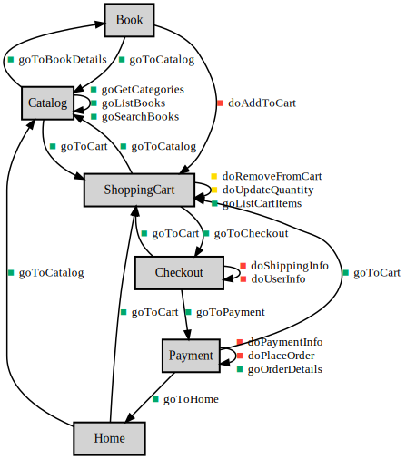

# ALPS Book Store

ALPS profile for managing an online bookstore catalog and defining the user purchase flow. This profile provides semantic definitions for both RESTful APIs and UI.

<!-- Container for the ASDs -->

## Semantic Descriptors

| Type | ID | Title | Contained | Extra Info |
| :--: | :-- | :---- | :-- | :-- |
| semantic | [author](#author) | Author |  | def:<a href="https://schema.org/author" target="_blank">schema.org/author</a>tag:<a href="#tag-catalog">catalog</a>doc:Name of the book&#039;s author. For multiple authors, names are comma-separated. |
| semantic | [Book](#Book) | Book | <a href="#id">id</a> <a href="#title">title</a> <a href="#author">author</a> <a href="#isbn">isbn</a> <a href="#price">price</a> <a href="#category">category</a> <a href="#goToCatalog">goToCatalog</a> <a href="#doAddToCart">doAddToCart</a> | def:<a href="https://schema.org/Book" target="_blank">schema.org/Book</a>tag:<a href="#tag-catalog">catalog</a>doc:Screen displaying individual book information. Shows detailed information, reviews, and related books. Items can be added to cart from this screen. |
| semantic | [Catalog](#Catalog) | Book Catalog | <a href="#Book">Book</a> <a href="#goListBooks">goListBooks</a> <a href="#goSearchBooks">goSearchBooks</a> <a href="#goGetCategories">goGetCategories</a> <a href="#goToBookDetails">goToBookDetails</a> <a href="#goToCart">goToCart</a> | def:<a href="https://schema.org/CollectionPage" target="_blank">schema.org/CollectionPage</a>tag:<a href="#tag-catalog">catalog</a>doc:Screen displaying all books. Provides category filtering, keyword search, and sorting functions. Default display is ordered by recent additions. |
| semantic | [Category](#Category) | Category | <a href="#id">id</a> <a href="#title">title</a> | def:<a href="https://schema.org/Category" target="_blank">schema.org/Category</a>tag:<a href="#tag-catalog">catalog</a>doc:Book genre classification. May have a hierarchical structure with parent and child categories. |
| semantic | [category](#category) | Category |  | def:<a href="https://schema.org/category" target="_blank">schema.org/category</a>tag:<a href="#tag-catalog">catalog</a>doc:Genre or category of the book. Books may belong to multiple categories. |
| semantic | [Checkout](#Checkout) | Checkout Screen | <a href="#goToPayment">goToPayment</a> <a href="#goToCart">goToCart</a> <a href="#doUserInfo">doUserInfo</a> <a href="#doShippingInfo">doShippingInfo</a> | tag:<a href="#tag-checkout">checkout</a>doc:Purchase procedure screen. Input user information, delivery destination, and proceed to payment. Displays final confirmation before order is placed. |
| unsafe | [doAddToCart](#doAddToCart) | Add to Cart | <a href="#id">id</a> <a href="#quantity">quantity</a> | tag:<a href="#tag-cart">cart</a>rel:collectionrt:<a href="#ShoppingCart">ShoppingCart</a>doc:Add the specified book to the shopping cart. If already in the cart, quantity is increased. Orders exceeding stock will result in an error. |
| unsafe | [doPaymentInfo](#doPaymentInfo) | Input Payment Information | <a href="#paymentMethod">paymentMethod</a> | tag:<a href="#tag-payment">payment</a>rt:<a href="#Payment">Payment</a>doc:Select order payment method and input necessary payment information. When credit card is selected, card information is input and validated. |
| unsafe | [doPlaceOrder](#doPlaceOrder) | Place Order |  | tag:<a href="#tag-order">order</a>rt:<a href="#Payment">Payment</a>doc:Confirm order based on user input information, process payment, and display order confirmation details on the payment screen. Payment processing is executed, inventory is secured, and a confirmation email is sent. This operation cannot be reversed. |
| idempotent | [doRemoveFromCart](#doRemoveFromCart) | Remove Item from Cart | <a href="#id">id</a> | tag:<a href="#tag-cart">cart</a>rt:<a href="#ShoppingCart">ShoppingCart</a>doc:Completely remove the specified item from the cart. If the item does not exist in the cart, no changes are made. |
| unsafe | [doShippingInfo](#doShippingInfo) | Input Shipping Information | <a href="#shippingAddress">shippingAddress</a> | tag:<a href="#tag-shipping">shipping</a>rt:<a href="#Checkout">Checkout</a>doc:Input product delivery address. Features automatic address input using postal code lookup. |
| idempotent | [doUpdateQuantity](#doUpdateQuantity) | Update Cart Item Quantity | <a href="#id">id</a> <a href="#quantity">quantity</a> | tag:<a href="#tag-cart">cart</a>rt:<a href="#ShoppingCart">ShoppingCart</a>doc:Update the quantity of a specific product in the cart. Values less than or equal to 0 cannot be specified. Quantities exceeding stock will result in an error. |
| unsafe | [doUserInfo](#doUserInfo) | Input User Information | <a href="#userName">userName</a> <a href="#userEmail">userEmail</a> | tag:<a href="#tag-customer">customer</a>rt:<a href="#Checkout">Checkout</a>doc:Input customer&#039;s name and email address. Email address is validated using regular expressions. |
| safe | [goGetBookDetails](#goGetBookDetails) | Get Book Details | <a href="#id">id</a> | tag:<a href="#tag-catalog">catalog</a>rel:itemrt:<a href="#Book">Book</a>doc:Retrieve detailed information for a specific book based on the specified book ID. Includes stock status and related book information. |
| safe | [goGetCategories](#goGetCategories) | Get Category List |  | tag:<a href="#tag-catalog">catalog</a>rel:collectionrt:<a href="#Catalog">Catalog</a>doc:Retrieve list of all available book categories. For hierarchical categories, parent-child relationships are also returned. |
| safe | [goListBooks](#goListBooks) | Get Book List |  | tag:<a href="#tag-catalog">catalog</a>rel:collectionrt:<a href="#Catalog">Catalog</a>doc:Retrieve list of all books in the catalog. Can specify pagination (default 20 items/page) and sort order (newest, price, popularity, etc.). |
| safe | [goListCartItems](#goListCartItems) | Get Cart Items List |  | tag:<a href="#tag-cart">cart</a>rel:collectionrt:<a href="#ShoppingCart">ShoppingCart</a>doc:Retrieve all products in the current shopping cart, including their quantities, subtotals, and total amount. |
| safe | [goOrderDetails](#goOrderDetails) | Display Order Details |  | tag:<a href="#tag-order">order</a>rt:<a href="#Payment">Payment</a>doc:Display detailed information for the confirmed order on the payment screen. Includes order number, list of purchased products, total amount, delivery destination, payment method, etc. |
| safe | [goSearchBooks](#goSearchBooks) | Search Books | <a href="#query">query</a> | tag:<a href="#tag-catalog">catalog</a>rel:collectionrt:<a href="#Catalog">Catalog</a>doc:Search for books based on specified search query. Can search across multiple fields including title, author name, content description, ISBN, etc. |
| safe | [goToBookDetails](#goToBookDetails) | Go to Book Details Screen | <a href="#id">id</a> | rt:<a href="#Book">Book</a>doc:Navigate to the detailed information screen for the selected book. Book ID must be specified. |
| safe | [goToCart](#goToCart) | Go to Cart Screen |  | rt:<a href="#ShoppingCart">ShoppingCart</a>doc:Navigate to the screen displaying the contents of the current shopping cart. |
| safe | [goToCatalog](#goToCatalog) | Go to Catalog Screen |  | rt:<a href="#Catalog">Catalog</a>doc:Navigate to the book catalog list screen. All books are displayed. |
| safe | [goToCheckout](#goToCheckout) | Go to Checkout Screen |  | rt:<a href="#Checkout">Checkout</a>doc:Navigate to the screen to confirm cart contents and proceed with purchase. Cannot transition if cart is empty. |
| safe | [goToHome](#goToHome) | Go to Home Screen |  | rt:<a href="#Home">Home</a>doc:Navigate to the application&#039;s home screen. Accessible from any screen. |
| safe | [goToPayment](#goToPayment) | Go to Payment Screen |  | rt:<a href="#Payment">Payment</a>doc:Navigate to the payment screen to input payment information and complete the order. |
| semantic | [Home](#Home) | Home Screen | <a href="#goToCatalog">goToCatalog</a> <a href="#goToCart">goToCart</a> | tag:<a href="#tag-navigation">navigation</a>doc:Starting point of the application. Displays site-wide navigation and promotional information. |
| semantic | [id](#id) | Identifier |  | def:<a href="https://schema.org/identifier" target="_blank">schema.org/identifier</a>tag:<a href="#tag-core">core</a>doc:Unique identifier for each resource. UUID or auto-generated integer. |
| semantic | [isbn](#isbn) | ISBN |  | def:<a href="https://schema.org/isbn" target="_blank">schema.org/isbn</a>tag:<a href="#tag-catalog">catalog</a>doc:International Standard Book Number. Formatted as ISBN-13 with hyphens. |
| semantic | [Payment](#Payment) | Payment Screen | <a href="#paymentMethod">paymentMethod</a> <a href="#goOrderDetails">goOrderDetails</a> <a href="#goToHome">goToHome</a> <a href="#goToCart">goToCart</a> <a href="#doPaymentInfo">doPaymentInfo</a> <a href="#doPlaceOrder">doPlaceOrder</a> | tag:<a href="#tag-payment">payment</a>doc:Screen for entering payment information, confirming the order, and displaying order completion details. Handles payment method selection, payment validation, order placement, and shows order number, total amount, and estimated delivery date upon completion. A confirmation email is sent automatically. |
| semantic | [paymentMethod](#paymentMethod) | Payment Method |  | def:<a href="https://schema.org/paymentMethod" target="_blank">schema.org/paymentMethod</a>tag:<a href="#tag-payment">payment</a>doc:Method of payment for the order. Options include credit card, cash on delivery, bank transfer, etc. |
| semantic | [price](#price) | Price |  | def:<a href="https://schema.org/price" target="_blank">schema.org/price</a>tag:<a href="#tag-commerce">commerce</a>doc:Sales price of the book. Pre-tax amount in JPY currency. |
| semantic | [quantity](#quantity) | Quantity |  | def:<a href="https://schema.org/quantityValue" target="_blank">schema.org/quantityValue</a>tag:<a href="#tag-commerce">commerce</a>doc:Quantity of books in the cart. Integer value greater than or equal to 1. |
| semantic | [query](#query) | Search Query |  | tag:<a href="#tag-catalog">catalog</a>doc:Keywords or conditions used for book searches. Can search by title, author name, ISBN, etc. |
| semantic | [shippingAddress](#shippingAddress) | Shipping Address |  | def:<a href="https://schema.org/address" target="_blank">schema.org/address</a>tag:<a href="#tag-shipping">shipping</a>doc:Delivery address for products. Includes postal code, prefecture, city, street address, and building name. |
| semantic | [ShoppingCart](#ShoppingCart) | Shopping Cart | <a href="#goListCartItems">goListCartItems</a> <a href="#goToCheckout">goToCheckout</a> <a href="#goToCatalog">goToCatalog</a> <a href="#doUpdateQuantity">doUpdateQuantity</a> <a href="#doRemoveFromCart">doRemoveFromCart</a> | def:<a href="https://schema.org/ShoppingCart" target="_blank">schema.org/ShoppingCart</a>tag:<a href="#tag-cart">cart</a>doc:Cart containing books the user intends to purchase. Allows quantity changes, deletion, and total amount confirmation. Managed on a session basis. |
| semantic | [title](#title) | Title |  | def:<a href="https://schema.org/name" target="_blank">schema.org/name</a>tag:<a href="#tag-catalog">catalog</a>doc:Title of book or category name. String with a maximum of 200 characters. |
| semantic | [totalAmount](#totalAmount) | Total Amount |  | def:<a href="https://schema.org/totalPrice" target="_blank">schema.org/totalPrice</a>tag:<a href="#tag-commerce">commerce</a>doc:Total amount for an order or cart contents. Displayed with tax included. |
| semantic | [userEmail](#userEmail) | Email Address |  | def:<a href="https://schema.org/email" target="_blank">schema.org/email</a>tag:<a href="#tag-customer">customer</a>doc:Customer&#039;s contact email address. Used for sending order confirmation emails. |
| semantic | [userName](#userName) | User Name |  | def:<a href="https://schema.org/name" target="_blank">schema.org/name</a>tag:<a href="#tag-customer">customer</a>doc:Name of the customer. First and last name separated by a space. |

## Links
* <a rel="issue" href="https://github.com/example/online-bookstore-api/issues">issue</a>

---

## Profile
<pre><code>&lt;?xml version=&quot;1.0&quot; encoding=&quot;UTF-8&quot;?&gt;
&lt;alps
        xmlns:xsi=&quot;http://www.w3.org/2001/XMLSchema-instance&quot;
        xsi:noNamespaceSchemaLocation=&quot;https://alps-io.github.io/schemas/alps.xsd&quot;&gt;
    &lt;title&gt;ALPS Book Store&lt;/title&gt;
    &lt;doc&gt;ALPS profile for managing an online bookstore catalog and defining the user purchase flow. This profile provides semantic definitions for both RESTful APIs and UI.&lt;/doc&gt;
    &lt;link href=&quot;https://github.com/example/online-bookstore-api/issues&quot; rel=&quot;issue&quot;/&gt;

    &lt;!-- Ontology (既存の記述はそのまま、変更なし) --&gt;
    &lt;descriptor id=&quot;id&quot; def=&quot;https://schema.org/identifier&quot; title=&quot;Identifier&quot; tag=&quot;core&quot;&gt;
        &lt;doc&gt;Unique identifier for each resource. UUID or auto-generated integer.&lt;/doc&gt;
    &lt;/descriptor&gt;
    &lt;descriptor id=&quot;title&quot; def=&quot;https://schema.org/name&quot; title=&quot;Title&quot; tag=&quot;catalog&quot;&gt;
        &lt;doc&gt;Title of book or category name. String with a maximum of 200 characters.&lt;/doc&gt;
    &lt;/descriptor&gt;
    &lt;descriptor id=&quot;author&quot; def=&quot;https://schema.org/author&quot; title=&quot;Author&quot; tag=&quot;catalog&quot;&gt;
        &lt;doc&gt;Name of the book&#039;s author. For multiple authors, names are comma-separated.&lt;/doc&gt;
    &lt;/descriptor&gt;
    &lt;descriptor id=&quot;isbn&quot; def=&quot;https://schema.org/isbn&quot; title=&quot;ISBN&quot; tag=&quot;catalog&quot;&gt;
        &lt;doc&gt;International Standard Book Number. Formatted as ISBN-13 with hyphens.&lt;/doc&gt;
    &lt;/descriptor&gt;
    &lt;descriptor id=&quot;price&quot; def=&quot;https://schema.org/price&quot; title=&quot;Price&quot; tag=&quot;commerce&quot;&gt;
        &lt;doc&gt;Sales price of the book. Pre-tax amount in JPY currency.&lt;/doc&gt;
    &lt;/descriptor&gt;
    &lt;descriptor id=&quot;category&quot; def=&quot;https://schema.org/category&quot; title=&quot;Category&quot; tag=&quot;catalog&quot;&gt;
        &lt;doc&gt;Genre or category of the book. Books may belong to multiple categories.&lt;/doc&gt;
    &lt;/descriptor&gt;
    &lt;descriptor id=&quot;quantity&quot; def=&quot;https://schema.org/quantityValue&quot; title=&quot;Quantity&quot; tag=&quot;commerce&quot;&gt;
        &lt;doc&gt;Quantity of books in the cart. Integer value greater than or equal to 1.&lt;/doc&gt;
    &lt;/descriptor&gt;
    &lt;descriptor id=&quot;totalAmount&quot; def=&quot;https://schema.org/totalPrice&quot; title=&quot;Total Amount&quot; tag=&quot;commerce&quot;&gt;
        &lt;doc&gt;Total amount for an order or cart contents. Displayed with tax included.&lt;/doc&gt;
    &lt;/descriptor&gt;
    &lt;descriptor id=&quot;userName&quot; def=&quot;https://schema.org/name&quot; title=&quot;User Name&quot; tag=&quot;customer&quot;&gt;
        &lt;doc&gt;Name of the customer. First and last name separated by a space.&lt;/doc&gt;
    &lt;/descriptor&gt;
    &lt;descriptor id=&quot;userEmail&quot; def=&quot;https://schema.org/email&quot; title=&quot;Email Address&quot; tag=&quot;customer&quot;&gt;
        &lt;doc&gt;Customer&#039;s contact email address. Used for sending order confirmation emails.&lt;/doc&gt;
    &lt;/descriptor&gt;
    &lt;descriptor id=&quot;shippingAddress&quot; def=&quot;https://schema.org/address&quot; title=&quot;Shipping Address&quot; tag=&quot;shipping&quot;&gt;
        &lt;doc&gt;Delivery address for products. Includes postal code, prefecture, city, street address, and building name.&lt;/doc&gt;
    &lt;/descriptor&gt;
    &lt;descriptor id=&quot;paymentMethod&quot; def=&quot;https://schema.org/paymentMethod&quot; title=&quot;Payment Method&quot; tag=&quot;payment&quot;&gt;
        &lt;doc&gt;Method of payment for the order. Options include credit card, cash on delivery, bank transfer, etc.&lt;/doc&gt;
    &lt;/descriptor&gt;
    &lt;descriptor id=&quot;query&quot; title=&quot;Search Query&quot; tag=&quot;catalog&quot;&gt;
        &lt;doc&gt;Keywords or conditions used for book searches. Can search by title, author name, ISBN, etc.&lt;/doc&gt;
    &lt;/descriptor&gt;

    &lt;!-- Taxonomy --&gt;
    &lt;descriptor id=&quot;Home&quot; title=&quot;Home Screen&quot; tag=&quot;navigation&quot;&gt;
        &lt;doc&gt;Starting point of the application. Displays site-wide navigation and promotional information.&lt;/doc&gt;
        &lt;descriptor href=&quot;#goToCatalog&quot;/&gt;
        &lt;descriptor href=&quot;#goToCart&quot;/&gt;
    &lt;/descriptor&gt;

    &lt;descriptor id=&quot;Catalog&quot; def=&quot;https://schema.org/CollectionPage&quot; title=&quot;Book Catalog&quot; tag=&quot;catalog&quot;&gt;
        &lt;doc&gt;Screen displaying all books. Provides category filtering, keyword search, and sorting functions. Default display is ordered by recent additions.&lt;/doc&gt;
        &lt;descriptor href=&quot;#goListBooks&quot;/&gt;
        &lt;descriptor href=&quot;#goSearchBooks&quot;/&gt;
        &lt;descriptor href=&quot;#goGetCategories&quot;/&gt;
        &lt;descriptor href=&quot;#goToBookDetails&quot;/&gt;
        &lt;descriptor href=&quot;#goToCart&quot;/&gt;
        &lt;descriptor href=&quot;#Book&quot;/&gt;
    &lt;/descriptor&gt;

    &lt;descriptor id=&quot;Book&quot; def=&quot;https://schema.org/Book&quot; title=&quot;Book&quot; tag=&quot;catalog&quot;&gt;
        &lt;doc&gt;Screen displaying individual book information. Shows detailed information, reviews, and related books. Items can be added to cart from this screen.&lt;/doc&gt;
        &lt;descriptor href=&quot;#id&quot;/&gt;
        &lt;descriptor href=&quot;#title&quot;/&gt;
        &lt;descriptor href=&quot;#author&quot;/&gt;
        &lt;descriptor href=&quot;#isbn&quot;/&gt;
        &lt;descriptor href=&quot;#price&quot;/&gt;
        &lt;descriptor href=&quot;#category&quot;/&gt;
        &lt;descriptor href=&quot;#doAddToCart&quot;/&gt;
        &lt;descriptor href=&quot;#goToCatalog&quot;/&gt;
    &lt;/descriptor&gt;

    &lt;descriptor id=&quot;Category&quot; def=&quot;https://schema.org/Category&quot; title=&quot;Category&quot; tag=&quot;catalog&quot;&gt;
        &lt;doc&gt;Book genre classification. May have a hierarchical structure with parent and child categories.&lt;/doc&gt;
        &lt;descriptor href=&quot;#id&quot;/&gt;
        &lt;descriptor href=&quot;#title&quot;/&gt;
    &lt;/descriptor&gt;

    &lt;descriptor id=&quot;ShoppingCart&quot; def=&quot;https://schema.org/ShoppingCart&quot; title=&quot;Shopping Cart&quot; tag=&quot;cart&quot;&gt;
        &lt;doc&gt;Cart containing books the user intends to purchase. Allows quantity changes, deletion, and total amount confirmation. Managed on a session basis.&lt;/doc&gt;
        &lt;descriptor href=&quot;#goListCartItems&quot;/&gt;
        &lt;descriptor href=&quot;#doUpdateQuantity&quot;/&gt;
        &lt;descriptor href=&quot;#doRemoveFromCart&quot;/&gt;
        &lt;descriptor href=&quot;#goToCheckout&quot;/&gt;
        &lt;descriptor href=&quot;#goToCatalog&quot;/&gt;
    &lt;/descriptor&gt;

    &lt;descriptor id=&quot;Checkout&quot; title=&quot;Checkout Screen&quot; tag=&quot;checkout&quot;&gt;
        &lt;doc&gt;Purchase procedure screen. Input user information, delivery destination, and proceed to payment. Displays final confirmation before order is placed.&lt;/doc&gt;
        &lt;descriptor href=&quot;#doUserInfo&quot;/&gt;
        &lt;descriptor href=&quot;#doShippingInfo&quot;/&gt;
        &lt;descriptor href=&quot;#goToPayment&quot;/&gt;
        &lt;descriptor href=&quot;#goToCart&quot;/&gt;
    &lt;/descriptor&gt;

    &lt;descriptor id=&quot;Payment&quot; title=&quot;Payment Screen&quot; tag=&quot;payment&quot;&gt;
        &lt;doc&gt;Screen for entering payment information, confirming the order, and displaying order completion details. Handles payment method selection, payment validation, order placement, and shows order number, total amount, and estimated delivery date upon completion. A confirmation email is sent automatically.&lt;/doc&gt;
        &lt;descriptor href=&quot;#paymentMethod&quot;/&gt;
        &lt;descriptor href=&quot;#doPaymentInfo&quot;/&gt;
        &lt;descriptor href=&quot;#doPlaceOrder&quot;/&gt;
        &lt;descriptor href=&quot;#goOrderDetails&quot;/&gt;
        &lt;descriptor href=&quot;#goToHome&quot;/&gt;
        &lt;descriptor href=&quot;#goToCart&quot;/&gt;
    &lt;/descriptor&gt;

    &lt;!-- Choreography --&gt;
    &lt;descriptor id=&quot;goToHome&quot; type=&quot;safe&quot; rt=&quot;#Home&quot; title=&quot;Go to Home Screen&quot;&gt;
        &lt;doc&gt;Navigate to the application&#039;s home screen. Accessible from any screen.&lt;/doc&gt;
    &lt;/descriptor&gt;
    &lt;descriptor id=&quot;goToCatalog&quot; type=&quot;safe&quot; rt=&quot;#Catalog&quot; title=&quot;Go to Catalog Screen&quot;&gt;
        &lt;doc&gt;Navigate to the book catalog list screen. All books are displayed.&lt;/doc&gt;
    &lt;/descriptor&gt;
    &lt;descriptor id=&quot;goToBookDetails&quot; type=&quot;safe&quot; rt=&quot;#Book&quot; title=&quot;Go to Book Details Screen&quot;&gt;
        &lt;doc&gt;Navigate to the detailed information screen for the selected book. Book ID must be specified.&lt;/doc&gt;
        &lt;descriptor href=&quot;#id&quot;/&gt;
    &lt;/descriptor&gt;
    &lt;descriptor id=&quot;goToCart&quot; type=&quot;safe&quot; rt=&quot;#ShoppingCart&quot; title=&quot;Go to Cart Screen&quot;&gt;
        &lt;doc&gt;Navigate to the screen displaying the contents of the current shopping cart.&lt;/doc&gt;
    &lt;/descriptor&gt;
    &lt;descriptor id=&quot;goToCheckout&quot; type=&quot;safe&quot; rt=&quot;#Checkout&quot; title=&quot;Go to Checkout Screen&quot;&gt;
        &lt;doc&gt;Navigate to the screen to confirm cart contents and proceed with purchase. Cannot transition if cart is empty.&lt;/doc&gt;
    &lt;/descriptor&gt;
    &lt;descriptor id=&quot;goToPayment&quot; type=&quot;safe&quot; rt=&quot;#Payment&quot; title=&quot;Go to Payment Screen&quot;&gt;
        &lt;doc&gt;Navigate to the payment screen to input payment information and complete the order.&lt;/doc&gt;
    &lt;/descriptor&gt;

    &lt;descriptor id=&quot;goListBooks&quot; type=&quot;safe&quot; rt=&quot;#Catalog&quot; rel=&quot;collection&quot; title=&quot;Get Book List&quot; tag=&quot;catalog&quot;&gt;
        &lt;doc&gt;Retrieve list of all books in the catalog. Can specify pagination (default 20 items/page) and sort order (newest, price, popularity, etc.).&lt;/doc&gt;
    &lt;/descriptor&gt;
    &lt;descriptor id=&quot;goSearchBooks&quot; type=&quot;safe&quot; rt=&quot;#Catalog&quot; rel=&quot;collection&quot; title=&quot;Search Books&quot; tag=&quot;catalog&quot;&gt;
        &lt;doc&gt;Search for books based on specified search query. Can search across multiple fields including title, author name, content description, ISBN, etc.&lt;/doc&gt;
        &lt;descriptor href=&quot;#query&quot;/&gt;
    &lt;/descriptor&gt;
    &lt;descriptor id=&quot;goGetCategories&quot; type=&quot;safe&quot; rt=&quot;#Catalog&quot; rel=&quot;collection&quot; title=&quot;Get Category List&quot; tag=&quot;catalog&quot;&gt;
        &lt;doc&gt;Retrieve list of all available book categories. For hierarchical categories, parent-child relationships are also returned.&lt;/doc&gt;
    &lt;/descriptor&gt;
    &lt;descriptor id=&quot;goGetBookDetails&quot; type=&quot;safe&quot; rt=&quot;#Book&quot; rel=&quot;item&quot; title=&quot;Get Book Details&quot; tag=&quot;catalog&quot;&gt;
        &lt;doc&gt;Retrieve detailed information for a specific book based on the specified book ID. Includes stock status and related book information.&lt;/doc&gt;
        &lt;descriptor href=&quot;#id&quot;/&gt;
    &lt;/descriptor&gt;

    &lt;descriptor id=&quot;doAddToCart&quot; type=&quot;unsafe&quot; rt=&quot;#ShoppingCart&quot; rel=&quot;collection&quot; title=&quot;Add to Cart&quot; tag=&quot;cart&quot;&gt;
        &lt;doc&gt;Add the specified book to the shopping cart. If already in the cart, quantity is increased. Orders exceeding stock will result in an error.&lt;/doc&gt;
        &lt;descriptor href=&quot;#id&quot;/&gt;
        &lt;descriptor href=&quot;#quantity&quot;/&gt;
    &lt;/descriptor&gt;
    &lt;descriptor id=&quot;goListCartItems&quot; type=&quot;safe&quot; rt=&quot;#ShoppingCart&quot; rel=&quot;collection&quot; title=&quot;Get Cart Items List&quot; tag=&quot;cart&quot;&gt;
        &lt;doc&gt;Retrieve all products in the current shopping cart, including their quantities, subtotals, and total amount.&lt;/doc&gt;
    &lt;/descriptor&gt;
    &lt;descriptor id=&quot;doUpdateQuantity&quot; type=&quot;idempotent&quot; rt=&quot;#ShoppingCart&quot; title=&quot;Update Cart Item Quantity&quot; tag=&quot;cart&quot;&gt;
        &lt;doc&gt;Update the quantity of a specific product in the cart. Values less than or equal to 0 cannot be specified. Quantities exceeding stock will result in an error.&lt;/doc&gt;
        &lt;descriptor href=&quot;#id&quot;/&gt;
        &lt;descriptor href=&quot;#quantity&quot;/&gt;
    &lt;/descriptor&gt;
    &lt;descriptor id=&quot;doRemoveFromCart&quot; type=&quot;idempotent&quot; rt=&quot;#ShoppingCart&quot; title=&quot;Remove Item from Cart&quot; tag=&quot;cart&quot;&gt;
        &lt;doc&gt;Completely remove the specified item from the cart. If the item does not exist in the cart, no changes are made.&lt;/doc&gt;
        &lt;descriptor href=&quot;#id&quot;/&gt;
    &lt;/descriptor&gt;

    &lt;descriptor id=&quot;doUserInfo&quot; type=&quot;unsafe&quot; rt=&quot;#Checkout&quot; title=&quot;Input User Information&quot; tag=&quot;customer&quot;&gt;
        &lt;doc&gt;Input customer&#039;s name and email address. Email address is validated using regular expressions.&lt;/doc&gt;
        &lt;descriptor href=&quot;#userName&quot;/&gt;
        &lt;descriptor href=&quot;#userEmail&quot;/&gt;
    &lt;/descriptor&gt;
    &lt;descriptor id=&quot;doShippingInfo&quot; type=&quot;unsafe&quot; rt=&quot;#Checkout&quot; title=&quot;Input Shipping Information&quot; tag=&quot;shipping&quot;&gt;
        &lt;doc&gt;Input product delivery address. Features automatic address input using postal code lookup.&lt;/doc&gt;
        &lt;descriptor href=&quot;#shippingAddress&quot;/&gt;
    &lt;/descriptor&gt;
    &lt;descriptor id=&quot;doPaymentInfo&quot; type=&quot;unsafe&quot; rt=&quot;#Payment&quot; title=&quot;Input Payment Information&quot; tag=&quot;payment&quot;&gt;
        &lt;doc&gt;Select order payment method and input necessary payment information. When credit card is selected, card information is input and validated.&lt;/doc&gt;
        &lt;descriptor href=&quot;#paymentMethod&quot;/&gt;
    &lt;/descriptor&gt;
    &lt;descriptor id=&quot;doPlaceOrder&quot; type=&quot;unsafe&quot; rt=&quot;#Payment&quot; title=&quot;Place Order&quot; tag=&quot;order&quot;&gt;
        &lt;doc&gt;Confirm order based on user input information, process payment, and display order confirmation details on the payment screen. Payment processing is executed, inventory is secured, and a confirmation email is sent. This operation cannot be reversed.&lt;/doc&gt;
    &lt;/descriptor&gt;

    &lt;descriptor id=&quot;goOrderDetails&quot; type=&quot;safe&quot; rt=&quot;#Payment&quot; title=&quot;Display Order Details&quot; tag=&quot;order&quot;&gt;
        &lt;doc&gt;Display detailed information for the confirmed order on the payment screen. Includes order number, list of purchased products, total amount, delivery destination, payment method, etc.&lt;/doc&gt;
    &lt;/descriptor&gt;
&lt;/alps&gt;
</code></pre>