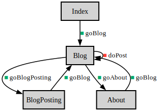

# ALPS Blog

An ALPS profile example for ASD

<!-- Container for the ASDs -->

## Links
* <a rel="issue" href="https://github.com/alps-asd/app-state-diagram/issues">issue</a>

## Semantic Descriptors

 *   [About](#About)
 *   [articleBody](#articleBody)
 *   [Blog](#Blog)
 *   [BlogPosting](#BlogPosting)
 *   [dateCreated](#dateCreated)
 *   [doPost](#doPost)
 *   [goAbout](#goAbout)
 *   [goBlog](#goBlog)
 *   [goBlogPosting](#goBlogPosting)
 *   [goStart](#goStart)
 *   [id](#id)
 *   [Index](#Index)

    

        
        Semantic
    

    

        
        Safe
    

    

        
        Unsafe
    

    

        
        Idempotent
    

### <a id="About">About</a>
 * type: semantic
 * descriptor

| id | type | title |
|---|---|---|
| [goBlog](#goBlog) | safe | to blog |

### <a id="articleBody">articleBody</a>
 * type: semantic
 * def: [https://schema.org/articleBody](https://schema.org/articleBody)

### <a id="Blog">Blog</a>
 * type: semantic
 * title: Blog post list
 * href: [https://schema.org/Blog](https://schema.org/Blog)
 * rel: collection
 * descriptor

| id | type | title |
|---|---|---|
| [BlogPosting](#BlogPosting) | semantic | Blog post item |
| [goAbout](#goAbout) | safe | to about |
| [goBlogPosting](#goBlogPosting) | safe | to blog posting |
| [doPost](#doPost) | unsafe | post article |

### <a id="BlogPosting">BlogPosting</a>
 * type: semantic
 * title: Blog post item
 * href: [https://schema.org/BlogPosting](https://schema.org/BlogPosting)
 * descriptor

| id | type | title |
|---|---|---|
| [id](#id) | semantic |  |
| [dateCreated](#dateCreated) | semantic |  |
| [articleBody](#articleBody) | semantic |  |
| [goBlog](#goBlog) | safe | to blog |

### <a id="dateCreated">dateCreated</a>
 * type: semantic
 * def: [https://schema.org/dateCreated](https://schema.org/dateCreated)

### <a id="doPost">doPost</a>
 * type: unsafe
 * title: post article
 * def: [https://activitystrea.ms/specs/json/1.0/#post-verb](https://activitystrea.ms/specs/json/1.0/#post-verb)
 * rt: [Blog](#Blog)
 * descriptor

| id | type | title |
|---|---|---|
| [articleBody](#articleBody) | semantic |  |

### <a id="goAbout">goAbout</a>
 * type: safe
 * title: to about
 * rt: [About](#About)

### <a id="goBlog">goBlog</a>
 * type: safe
 * title: to blog
 * rt: [Blog](#Blog)

### <a id="goBlogPosting">goBlogPosting</a>
 * type: safe
 * title: to blog posting
 * rt: [BlogPosting](#BlogPosting)
 * descriptor

| id | type | title |
|---|---|---|
| [id](#id) | semantic |  |

### <a id="goStart">goStart</a>
 * type: safe
 * title: to start
 * rt: [Blog](#Blog)

### <a id="id">id</a>
 * type: semantic
 * def: [https://schema.org/identifier](https://schema.org/identifier)

### <a id="Index">Index</a>
 * type: semantic
 * title: Index Page
 * descriptor

| id | type | title |
|---|---|---|
| [goBlog](#goBlog) | safe | to blog |

---

## Profile
<pre><code>&lt;?xml version=&quot;1.0&quot; encoding=&quot;UTF-8&quot;?&gt;
&lt;alps
     xmlns:xsi=&quot;http://www.w3.org/2001/XMLSchema-instance&quot;
     xsi:noNamespaceSchemaLocation=&quot;https://alps-io.github.io/schemas/alps.xsd&quot;&gt;
    &lt;title&gt;ALPS Blog&lt;/title&gt;
    &lt;doc&gt;An ALPS profile example for ASD&lt;/doc&gt;
    &lt;link href=&quot;https://github.com/alps-asd/app-state-diagram/issues&quot; rel=&quot;issue&quot;/&gt;

    &lt;!-- Ontology --&gt;
    &lt;descriptor id=&quot;id&quot; def=&quot;https://schema.org/identifier&quot;/&gt;
    &lt;descriptor id=&quot;articleBody&quot; def=&quot;https://schema.org/articleBody&quot;/&gt;
    &lt;descriptor id=&quot;dateCreated&quot; def=&quot;https://schema.org/dateCreated&quot;/&gt;

    &lt;!-- Taxonomy --&gt;
    &lt;descriptor id=&quot;Index&quot; title=&quot;Index Page&quot;&gt;
        &lt;descriptor href=&quot;#goBlog&quot;/&gt;
    &lt;/descriptor&gt;
    &lt;descriptor id=&quot;About&quot;&gt;
        &lt;descriptor href=&quot;#goBlog&quot;/&gt;
    &lt;/descriptor&gt;
    &lt;descriptor id=&quot;Blog&quot; href=&quot;https://schema.org/Blog&quot; title=&quot;Blog post list&quot; rel=&quot;collection&quot;&gt;
        &lt;descriptor href=&quot;#goAbout&quot;/&gt;
        &lt;descriptor href=&quot;#doPost&quot;/&gt;
        &lt;descriptor href=&quot;#goBlogPosting&quot;/&gt;
        &lt;descriptor href=&quot;#BlogPosting&quot;/&gt;
    &lt;/descriptor&gt;
    &lt;descriptor id=&quot;BlogPosting&quot; href=&quot;https://schema.org/BlogPosting&quot; title=&quot;Blog post item&quot;&gt;
        &lt;descriptor href=&quot;#id&quot;/&gt;
        &lt;descriptor href=&quot;#dateCreated&quot;/&gt;
        &lt;descriptor href=&quot;#articleBody&quot;/&gt;
        &lt;descriptor href=&quot;#goBlog&quot;/&gt;
    &lt;/descriptor&gt;

    &lt;!-- Choreography --&gt;
    &lt;descriptor id=&quot;goStart&quot; type=&quot;safe&quot; title=&quot;to start&quot; rt=&quot;#Blog&quot;/&gt;
    &lt;descriptor id=&quot;goAbout&quot; type=&quot;safe&quot; title=&quot;to about&quot; rt=&quot;#About&quot;/&gt;
    &lt;descriptor id=&quot;goBlog&quot; type=&quot;safe&quot; title=&quot;to blog&quot; rt=&quot;#Blog&quot;/&gt;
    &lt;descriptor id=&quot;goBlogPosting&quot; type=&quot;safe&quot; title=&quot;to blog posting&quot; rt=&quot;#BlogPosting&quot;&gt;
        &lt;descriptor href=&quot;#id&quot;/&gt;
    &lt;/descriptor&gt;
    &lt;descriptor id=&quot;doPost&quot; def=&quot;https://activitystrea.ms/specs/json/1.0/#post-verb&quot; type=&quot;unsafe&quot; title=&quot;post article&quot; rt=&quot;#Blog&quot;&gt;
        &lt;descriptor href=&quot;#articleBody&quot;/&gt;
    &lt;/descriptor&gt;
&lt;/alps&gt;
</code></pre>